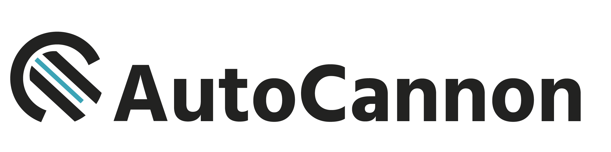

# Autocannon-storage

A utility module for storing autocannon results in s3 and sorting/retrieving them in useful manners.

## Usage

### Command-line

```
Usage: autocannon-storage {command} [opts]

A convenient command-line library for storing autocannon results in S3

Available commands:
  save
    Save autocannon results to s3
  load
    Load autocannon results from s3 and output them as ndjson

Available options:

  -i/--input FILE
        The path to some json results to save. Required when not piping into this tool.
  -o/--output DIRECTORY
        The path to some directory to save results in. Will save results in `${result.finish}.json`
  -c/--credentials FILE
        The path to some json file with S3 credentials
  -k/--accessKey S3_ACCESS_KEY
        Some S3 access key
  -K/--secretKey S3_SECRET_KEY
        Some S3 secret key
  -b/--bucket NAME
        The title of some S3 bucket
  -a/--amount AMOUNT
        The amount of results to load
  -t/--tag TAG
        A semver version tag to tag the results with if doing a save.
        An NPM version tag to filter results by if doing a load.
  -v/--version
        Print the version number.
  -h/--help
        Print this menu.
```

### Example

saving
```
autocannon -d 30 -j localhost:3000 | autocannon-storage save -c ./s3Credentials.json -t `node -e "console.log(require('./package.json').version)"`
```

loading
```
autocannon-storage load -c ./s3Credentials.json -t ">=1.0.0" | autocannon-reporter
```

### Programmatically

```js
'use strict'

const storage = require('autocannon-storage')
const abstractBlobStore = require('abstract-blob-store')
const autocannonResults = require('./SOME_AUTOCANNON_RESULTS')

storage.createStore(abstractBlobStore, function (err, store) {
  store.save(autocannonResults, function (error) {
    // ...
  })
  store.load({}, function (error, results) {
    // ...
  })
})
```

## API

### createStore(store, callback)

Creates an autocannon-storage store that wraps around some library that the implements
[abstract-blob-store](https://github.com/maxogden/abstract-blob-store) api

* `store`: An object that implements the [abstract-blob-store](https://github.com/maxogden/abstract-blob-store) API
* `callback(err, store)`: the callback that is called when the store is instantiated. This takes an `error` and `store` as parameters. The store implements the store api described below.

### Store API

An autocannon store object is passed in the callback of the `createStore`, and it wraps
an abstract-blob-store library. It has the following methods.

## store.save(results, cb, metadata)

This takes autocannon results and saves it in the store. These results can also have an added `tag` attribute with semver tags for utilty filtering later.

The callback takes `error` and `metadata` parameters for utility purposes.

## store.load(opts, cb)

This takes a set of options and loads results matching those params from the store.

The callback takes `error` and `results` parameters.

* `opts.amt`: The amount of results to load
* `opts.sort`: a sorting function which is used to sort results before returning. defaults to sorting by most recent `finish` time in the autocannon results

## store.filter(opts, cb)

This takes a set of options and filters results to matching those params from the store.

The callback takes `error` and `results` parameters.

* `opts.filter`: A filter function which should return true if some metadata passed to it should be included in the downloaded results. Can be used to filter by tags.
* `opts.amt`: The amount of results to load
* `opts.sort`: a sorting function which is used to sort results before returning. defaults to sorting by most recent `finish` time in the autocannon results

### Utility

### createS3Store(credentials, bucket)

A wrapper around s3-blob-store that creates and returns that store when passed valid credentials and a bucket name

Valid credentials have accessKey and secretKey attributes. Used by the command line functionality.


## Acknowlegements

Sponsored by [nearform](http://www.nearform.com)

## License

[MIT](./LICENSE).
